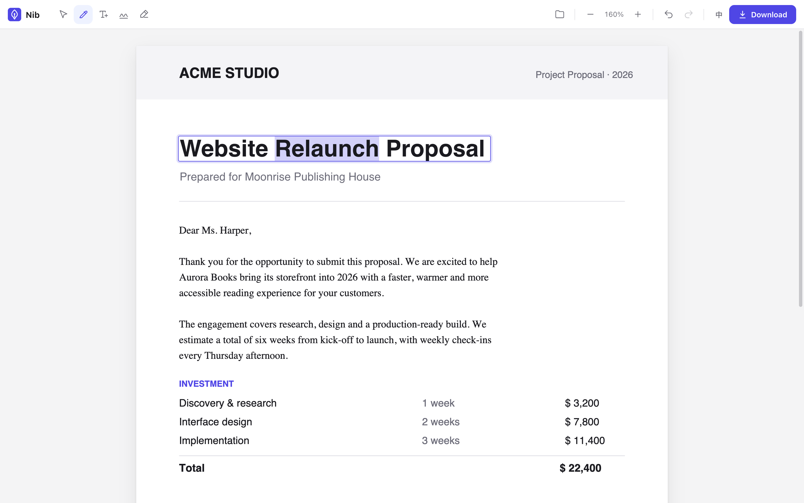
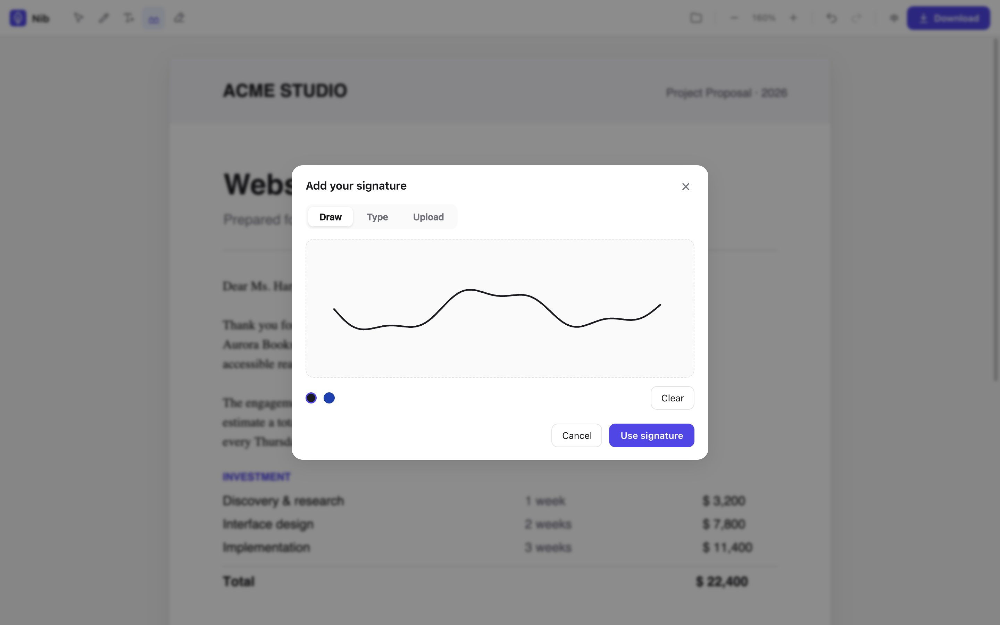

<div align="center">


# Nib

**A tiny PDF editor that lives in your browser.**
Click a line of text, retype it, download. The file never leaves your device.

[](LICENSE)
[](#how-it-works)
[](#privacy-the-actual-feature)
[](#contributing)

**[▶ Try it live](https://alanturing01.github.io/nibpdf/)** — no signup, no upload, no watermark.

**English** | [简体中文](README.zh-CN.md)

<picture>
  <source media="(prefers-color-scheme: dark)" srcset="docs/hero-dark.png">
  <source media="(prefers-color-scheme: light)" srcset="docs/hero-light.png">
  
</picture>

</div>

It's 6:58 PM, the contract goes out at 7:00, and the date on page 3 says **March 12** instead of **March 21**. Your options used to be: upload the private contract to a stranger's server and get it back with a watermark, install a desktop suite weighing hundreds of megabytes, or print it, fix it with a pen, and scan it.

Nib is the missing fourth option: open a tab, click the date, retype it, download.

## Why you might like this

- **Zero build step.** No bundler, no transpiler, no `node_modules`. Clone the repo, serve the folder with any static server, and it runs.
- **~2,000 lines of vanilla JS** you can actually read in an afternoon. No framework. The whole app is right there.
- **Vendored dependencies.** [pdf.js](https://mozilla.github.io/pdf.js/) v6 (rendering), [pdf-lib](https://pdf-lib.js.org/) (writing), and [fontkit](https://github.com/foliojs/fontkit) (font subsetting) live in the repo.
- **A neat font-subsetting trick.** Non-Latin text needs an embedded font, so Nib subsets yours down to only the glyphs you used — a 22 MB font becomes ~16 KB inside the PDF.

## Quickstart

```bash
git clone https://github.com/AlanTuring01/nibpdf
cd nibpdf
python3 -m http.server 8080    # or: npx serve
```

Open <http://localhost:8080>. (ES modules + workers need HTTP — `file://` won't work.)

Or skip all that and use the **[live demo](https://alanturing01.github.io/nibpdf/)** — it's the same static files, hosted on GitHub Pages.

## Features

**✏️ Edit text that's already in the PDF.** Click a line, retype, done. Nib merges fragmented PDF text runs into editable lines, samples the original ink and background colors from the rendered page, and matches font size and family (serif / sans / mono, bold / italic) — edits blend in like they were always there.

**🖋 Signatures.** Draw with mouse or finger (smoothed strokes, black or blue ink), type your name in cursive or serif styles, or upload a photo of a paper signature — Nib strips the white background automatically. Drag and resize anywhere.

<div align="center">
  
</div>

**➕ Add text & white-out.** New text with adjustable size, three colors, multiline. White-out auto-samples the page background color, so it works on non-white pages too.

**🌏 中文, 日本語, any Unicode.** PDF's 14 built-in fonts are Latin-only — which is why most tools silently break on Chinese or Japanese text. Nib asks once for a font — picked from your system via the Local Font Access API (Chrome/Edge), or drop in any `.ttf`/`.otf` — and embeds only the glyphs you used.

**⌨️ Feels like a real editor.** Undo/redo everything (<kbd>Cmd/Ctrl</kbd>+<kbd>Z</kbd>), zoom, one-key tool switching: <kbd>V</kbd> <kbd>E</kbd> <kbd>T</kbd> <kbd>S</kbd> <kbd>W</kbd>.

**🌐 中文/English UI**, auto-detected, one-click toggle. Light and dark theme, following your system.

**📄 Real-world PDFs.** Rotated pages (`/Rotate` 90/180/270) handled correctly, multi-page documents, lazy page rendering.

## Privacy (the actual feature)

Nib is **100% client-side**. Your file **never** leaves your device.

- No upload. No server. No account. No tracking. No watermark. No file-size limit.
- Works offline after the first load.
- All libraries are vendored locally.

Don't take our word for it — open DevTools and watch the network tab: **zero requests after page load**, including while you open, edit, and save a PDF.

## How it works

```
your.pdf
   │
   ▼
┌────────────────────────────────────────────┐
│ pdf.js v6 · renders each page to canvas    │
└──────────────────────┬─────────────────────┘
                       │  text runs + pixels
┌──────────────────────▼─────────────────────┐
│ app · ~2,000 lines of vanilla JS           │
│ merge runs · sample colors · match fonts   │
└──────────────────────┬─────────────────────┘
                       │  edit ops
┌──────────────────────▼─────────────────────┐
│ pdf-lib + fontkit · cover-and-replace      │
│ edits, fonts subset to the glyphs used     │
└──────────────────────┬─────────────────────┘
                       ▼
            edited.pdf · never left your device
```

Three parts do the heavy lifting:

1. **Text-run merging.** PDFs store text as arbitrary fragments — a single sentence might be a dozen positioned runs. Nib stitches runs that share a baseline into one editable line, which is what makes "click and retype" possible.
2. **Pixel sampling.** When you edit a line, Nib reads the rendered canvas to sample the original text color *and* the background behind it, so the patch is painted in the page's own colors instead of assuming black-on-white.
3. **Glyph-level font subsetting.** When you type non-Latin text, fontkit carves out just the glyphs you used from your chosen font and pdf-lib embeds that sliver — kilobytes, not megabytes.

No framework, no state library, no build pipeline. View-source works — which, for a tool you feed contracts to, is rather the point.

## Nib vs. the alternatives

| | Online PDF editors | Desktop suites | **Nib** |
|---|---|---|---|
| Your file | Uploaded to their servers | Stays local | **Stays local** |
| Price | Paywalls & watermarks | Subscriptions | **Free (MIT)** |
| Install | — | Hundreds of MB | **None — it's a web page** |
| File-size limits | Usually | No | **No** |
| Source | Closed | Usually closed | **Open** |

## FAQ & honest limitations

**Is this a redaction tool?**
**No.** Text edits use the classic cover-and-replace technique: the original characters remain inside the file's content stream, and copy-paste or text extraction can still find them. Perfect for fixing a typo; **not** for hiding secrets. True glyph-level removal is on the roadmap.

**Does white-out securely remove content?**
Same answer — it's cosmetic, not secure redaction.

**Can I edit rotated or vertical text?**
Rotated *pages* work fine. Rotated or vertical text *within* a page can't be edited yet — you'll get a friendly toast instead of a broken edit.

**Password-protected PDFs?**
Not supported.

**Will my edit use the document's exact font?**
Replacement text uses a matched standard font (or your chosen Unicode font), not the document's embedded font. For sans/serif body text it's usually indistinguishable.

**Scanned PDFs?**
Scans are images — there's no text to edit. White-out and add-text still work.

## Roadmap

- [ ] True text removal from content streams (real redaction)
- [ ] Page management: reorder / delete / rotate
- [ ] Form filling
- [ ] Freehand annotations
- [ ] PWA offline install

## Contributing

The whole point of Nib is that it's hackable:

1. Clone, start a static server, open the app.
2. Edit the JS. Refresh. That's the entire workflow — no build, no watch mode, no dependency install.

Bug reports with a sample PDF (nothing sensitive!) are gold. PRs welcome — the codebase is small enough to hold in your head.

## License

[MIT](LICENSE) — do whatever you want, just don't upload your contracts to strangers.
